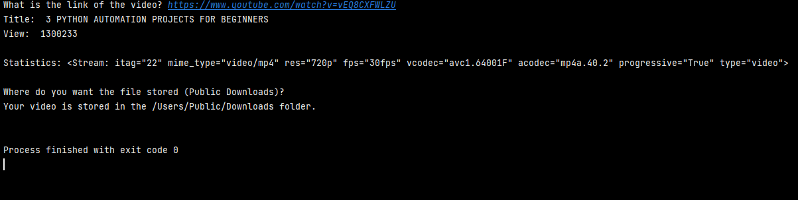

This is a program that is built specifically to download videos from YouTube.

It is interactive, so all you really need is the link. I don't know if the .exe file will
make it into Github. But if you download that from the `dist` folder, it pulls up a simple command line interface
that just asks for the URL of the video. This will get flagged by virus scanners being an .exe. 
You don't have to download the .exe file to run the program. If you do and verify that it isn't a virus,
it is just copy and paste. No need for formatting.
It will print out some statistics about the highest resolution that is being downloaded.
After that, it will ask you where you want the video file stored. This is defaulted to 
the Public Downloads folder on Windows based systems. 
### Have not tested this on Linux or Mac OSs.

After you have either hit the `Enter` key or specified your ouptut folder, the program
will wait 5 seconds to show the output file location and then cease.The window will close 
itself. 
---

---
This project is a modified version of Project 2 from the video tutorial [3 Python Animation
Projects For Beginners](https://www.youtube.com/watch?v=vEQ8CXFWLZU). It's a very good video!
I just added some extra functionality and made it a little more user interactive.
